    
    
    
    
    
    

  中文 | <a href="README.md" rel="noreferrer">English</a>

  
  

<h2 align="left">常用开发语言:</h2>

  
  
  
  
  
  
  
  

  

## 常用开发框架与工具:
### 前端框架:

### 后端框架:

### 数据库:

### 云生态与开发运维:

### GIS与地理空间:

### 移动与嵌入式开发

### AI编程工具与大语言模型 (LLM)

